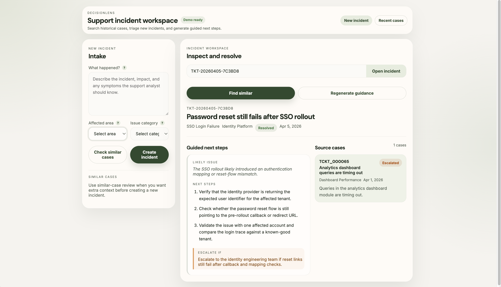

# DecisionLens



DecisionLens is a support incident intelligence workspace that uses semantic search and GPT-assisted guidance to improve triage and issue resolution.

Instead of treating tickets as isolated records, it turns historical incidents into a searchable system that helps answer:

- Have we seen this issue before?
- Which past incidents are most relevant?
- What should the support analyst do next?

The system is designed around a realistic support workflow, focusing on how historical incident knowledge can be reused during intake and triage.

## Why I built it

Support teams accumulate large volumes of incident history, but that knowledge is difficult to reuse quickly during intake and triage. Useful fixes and recurring issue patterns are often buried in past tickets.

DecisionLens explores how a support workspace can:

- perform semantic retrieval instead of keyword search
- surface likely duplicates during intake
- provide relevant historical context for triage
- generate grounded troubleshooting guidance using RAG

## What it does

DecisionLens combines:

- semantic retrieval over 100K+ incidents
- duplicate-aware intake review
- RAG-based troubleshooting guidance using GPT-4

The system supports:

1. Creating a new incident from an intake form
2. Reviewing similar or duplicate incidents before submission
3. Opening an incident by ID or ticket ID
4. Retrieving semantically similar historical incidents
5. Generating structured troubleshooting guidance from retrieved cases

The frontend is implemented as a React-based incident workspace, designed to simulate a production-style support interface.

## Core workflow

### 1. Intake

A user describes a new issue and can optionally provide:

- affected area
- issue category

Before submission, the system performs a duplicate-aware review to surface:

- likely duplicate requests
- related historical incidents
- contextual signals for better triage decisions

### 2. Incident retrieval

Once an incident is opened, DecisionLens retrieves similar incidents using OpenAI embeddings and pgvector.

The retrieval pipeline includes:

- vector similarity search (<50ms retrieval latency)
- reranking using relevance, recency, and priority signals
- grouping repetitive incident templates into representative results

### 3. Guided next steps

Retrieved incidents are used as RAG context for GPT-4.

The system generates structured troubleshooting guidance:

- likely issue
- next steps
- escalation conditions

This allows support analysts to convert historical incident knowledge into actionable guidance quickly.

## Architecture

```text
React incident workspace
    |
    +--> intake panel
    +--> incident workspace
    +--> source-case sidebar
    |
    v
FastAPI backend
    |
    +--> PostgreSQL (incident storage)
    +--> pgvector (semantic search, <50ms)
    +--> OpenAI embeddings (vector generation)
    +--> duplicate-aware intake logic
    +--> GPT-4 RAG workflow
```

## Tech stack

- Frontend: React, Vite, CSS
- Backend: FastAPI, Pydantic, Uvicorn
- Database: PostgreSQL with pgvector
- Search: OpenAI embeddings + cosine similarity
- LLM: GPT-4 with retrieval-augmented generation
- Data tooling: pandas, NumPy
- Deployment: Docker, Docker Compose, Nginx

## Running locally

### Frontend demo workspace

```bash
cd frontend
npm install
npm run dev
```

Runs the React workspace locally with mock incident data and local state.

### Full stack

```bash
docker compose up --build
```

Available services:

- Frontend: `http://localhost:3000`
- API: `http://localhost:5000`
- API docs: `http://localhost:5000/docs`

### Load historical incidents

```bash
docker compose run --rm api python data/load_incidents.py
```

### Generate embeddings

```bash
docker compose run --rm api python ml/embedding_service.py
```

This one-time step makes the dataset searchable.  
New incidents generate embeddings automatically in the background.

### Backend only

```bash
source venv/bin/activate
uvicorn api.main:app --reload --host 0.0.0.0 --port 5000
```

## Testing & Evaluation

Validation during development included:

### Basic checks

- frontend build validation
- backend startup and route validation

### Manual workflow testing

- create and review incidents from intake
- validate duplicate suggestions before submission
- run semantic retrieval from workspace
- regenerate guided troubleshooting steps

### Evaluation support

- evaluation datasets for duplicate detection and RAG quality
- scripts for threshold tuning and retrieval validation

These ensure retrieval results and generated guidance are directionally useful.

## Project scope

### Implemented

- semantic retrieval over historical incidents
- duplicate-aware intake workflow
- RAG-based troubleshooting guidance
- backend + frontend integration
- low-latency vector search

### In progress

- duplicate threshold tuning
- prompt and retrieval improvements
- deeper frontend-backend integration
